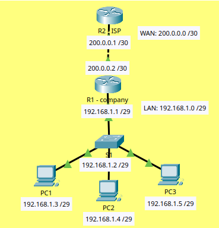

# Basic Office Network Lab

## Objective

Simulate a small office network connected to an ISP.

## Topology

## Network Design

LAN: 192.168.1.0/29  
WAN: 200.0.0.0/30  

## Devices

- 3 PCs
- 1 Switch
- 2 Routers

## IP Addressing

Router (Gateway): 192.168.1.1  
Switch (Management): 192.168.1.2  

PC1: 192.168.1.3  
PC2: 192.168.1.4  
PC3: 192.168.1.5  

ISP Router: 200.0.0.1  
Company Router (WAN): 200.0.0.2  

## Concepts Practiced

- IP addressing
- Subnetting (/29 and /30)
- Default gateway
- Basic routing
- ISP simulation

## Troubleshooting

Issue: PCs could not reach the ISP router.

Cause: Missing return route on ISP router.

Solution:
Configured static route on ISP:
ip route 192.168.1.0 255.255.255.248 200.0.0.2

## Tools

- Cisco Packet Tracer
